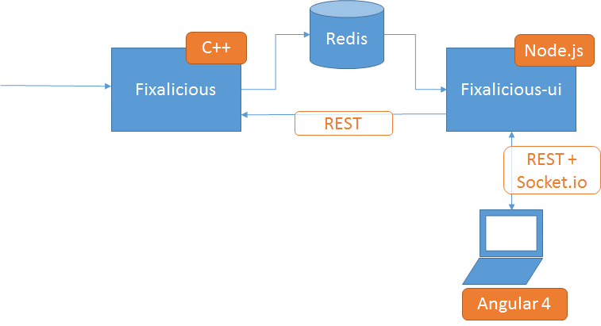

FIXalicious UI
==============

FIXalicious UI is a front end for the FIXalicious FIX simulator.
It uses node.js, Angular, ag-grid, redis, and socket.io to provide a realtime and interactive UI for sending and automating FIX simulations.

## Prerequisites
- node.js [https://nodejs.org](https://nodejs.org)
- typescript [https://www.typescriptlang.org](https://www.typescriptlang.org)
- redis [https://redis.org](https://redis.io)
- fixalicious [https://github.com/rbaxter1](https://github.com/rbaxter1/fixalicious)


# Design
Fixalcious-ui is a front end to Fixalicious, so it is quite useless by itself. This project has two parts, a node.js server and an Angular client.

The server communicates to Fixalicious using shared keys in Redis for realtime messaging, and HTTP REST calls to send new messages. It also persists configuration for the client, such as action templates and scenarios.

The client calls the server APIs to get data, and subscribes to a socket.io channel for realtime updates of FIX transations and session information.



# Run it!

## Client

The client is written in Typescript and needs to be built before it can be run. Make sure you have a recent version of Typescript installed!
Change to the client folder, install dependencies, and build it:
```
> cd client
> npm install
> tsc
```
If you get compilating errors, your version of Typescript may be older. Sometimes Typescript has been installed by Visual Studio and that is in your PATH. If so, I recommend removing it from your PATH.

To see what version is running: 
```
> tsc -v
```

To see where it's running from (on Windows):
```
> where tsc.exe
```

## Prerequisites

* Redis: https://github.com/MicrosoftArchive/redis/releases


## Fixalicious integration

When you start fix-svr, you must specify the following options:
```
--use_redis --redis_listeners ui
```

## Server

The server only needs dependencies installed, so change to the server folder, install dependencies, and run the following:
```
> cd server
> npm install
> node server.js
```

That's it! you're up and running with the defaults. Navigate to localhost:4400 or go directly to the client.
```
http://localhost:4400/client
```

## Options

Fixalicious can publish on multiple channels. By default, we listen to the channel "ui". This can be changed using the "subscriber" argument. 

For all options, run with the -? switch:

```
> node server.js -?
Options:
  --port, -p        	Port to serve HTTP content                 [default: "4400"]
  --subscriber, -s  	FIXalicious channel                          [default: "ui"]
  --redis_host      	Redis server hostname                 [default: "localhost"]
  --redis_port      	Redis server port                          [default: "6379"]
  --fixalicious_host  	FIXalicious server host                          [default: "localhost"]
  --fixalicious_port    FIXalicious server port                          [default: "9999"]
  --help, -?        Show help                                          [boolean]

```


# Usage Overview

## Functions

Use the following syntax to reference a tag:

```
${tag(11)}
```

To generate a new ID
```
${newId()}
```

To generate a new timestamp in UTC
```
${timestamp()}
```

# Troubleshooting

## 1.rxjs versioning issue

Symptoms: 

UI is stuck at "Starting up....". 

In F12 Developer tool console, it complains about rxjs  

```
Error: (SystemJS) XHR error (404 Not Found) loading http://localhost:4400/client/node_modules/rxjs/operators.js  Error: Resource Not Found
```

On Server side, it shows error:
```
Error: Resource Not Found
    at app.use (D:\Fixacilious-latest\fixalicious-ui\server\swagger.js:69:15)
    at Layer.handle [as handle_request] (D:\Fixacilious-latest\fixalicious-ui\se
rver\node_modules\express\lib\router\layer.js:95:5)
......
    at SendStream.error (D:\Fixacilious-latest\fixalicious-ui\server\node_module
s\serve-static\index.js:120:7)
    at emitOne (events.js:96:13)
    at SendStream.emit (events.js:188:7)
    at SendStream.error (D:\Fixacilious-latest\fixalicious-ui\server\node_module
s\serve-static\node_modules\send\index.js:245:17)
```

Causes: rxjs package got updated to rxjs@5.5.2 

Solution: downgrade rxjs package to rxjs@5.4.3
in the client folder, run cmd as administrator
```
>npm uninstall rxjs
>npm install rxjs@5.4.3
>npm list --depth=0
```
  

    
